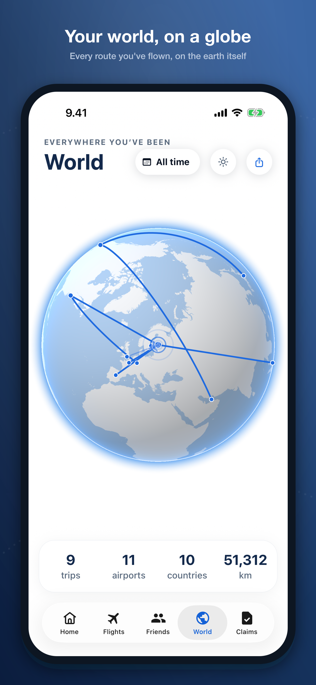
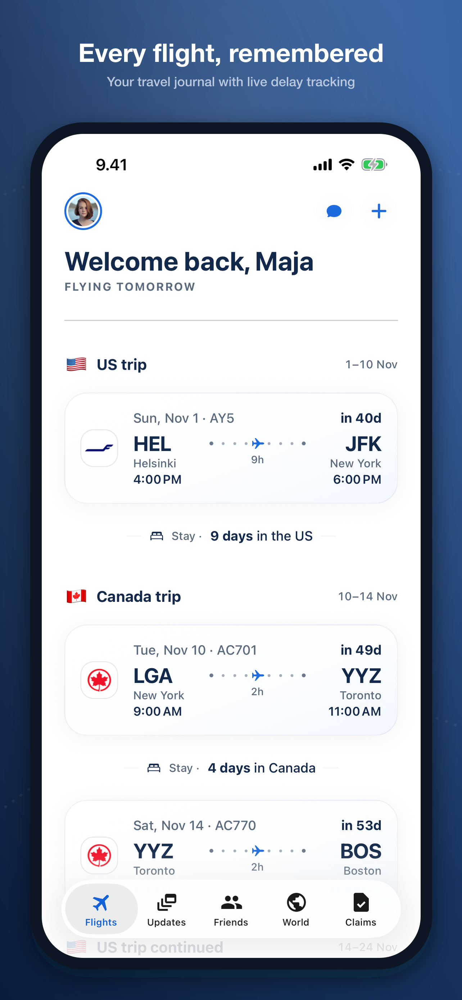
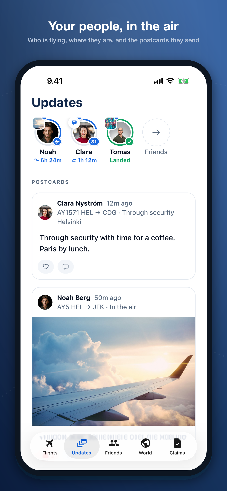
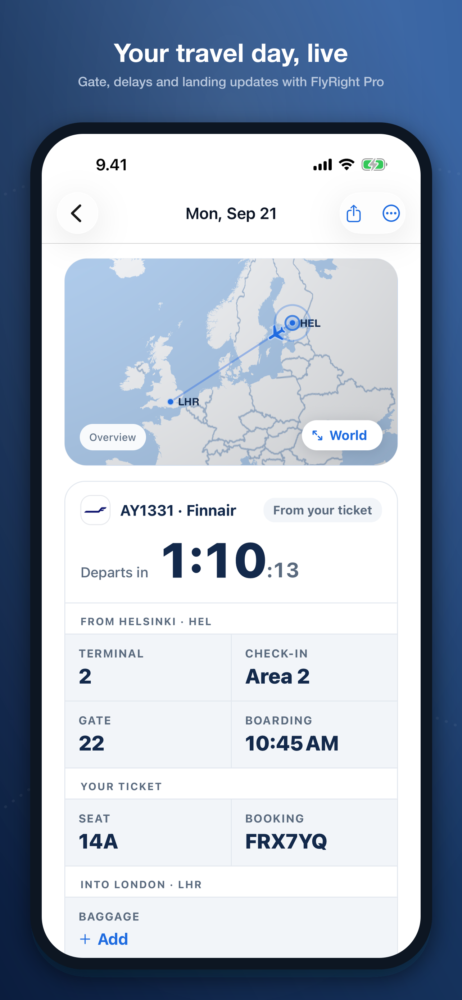
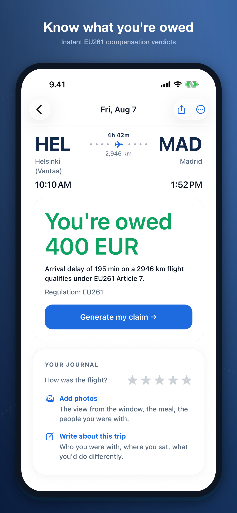

# FlyRight ✈️

**Your travel buddy on the day you fly — and your advocate when the flight goes wrong.**

Listed on the stores as **FlyRight: Flight Tracker** — *Travel buddy & delay claims*.
Flight trackers tell you your flight is late. FlyRight is with you for the whole day, keeps the people who care in the loop, and — when a flight does go wrong — tells you what the airline owes you and helps you claim it.

<p align="center">
  
  
  
  
  
</p>

## What FlyRight is really about

FlyRight is a travel companion first. It starts the moment you add a flight — by number, from a boarding pass, or by sharing the airline's PDF — and stays with you through the day: check-in, gate, boarding, layovers, landing. Your trips become a journal with photos and notes, a world map of everywhere you've flown, and a circle of people who can follow your travel day live instead of asking "did you land?".

Claims are the safety net, not the headline. Because FlyRight is already tracking your flight, the same moment you learn about a 3-hour delay you also learn it's worth up to €600 under EU261, and you can start the claim right from the notification. Most people never need that part. When they do, it's already there.

That position is unique because the two halves reinforce each other:

- **Claims services** (web forms you find after the fact) don't know you're flying until you come to them days later, receipts in hand.
- **Flight trackers** know you're flying but stop at "your flight is delayed" — and they don't know who's waiting for you at the other end.

FlyRight sits in both seats. Being with you on travel day is what earns it the right to act for you when the day goes wrong.

The timing matters too: since the 2026 EU passenger-rights reform, airlines are legally required to disclose your rights during a disruption — while compensation of €250–600 stays intact. Awareness of passenger rights is going up, but exercising them still mostly means a web form built a decade ago. FlyRight puts that process in your pocket, at the airport, at the moment it applies.

## What it does

- **Travel Day Live** — a boarding-pass style hero card, iOS Live Activity and Android live notification that follow your flight through the day: check-in, gate, boarding, layovers, delays, landing.
- **Add a flight in seconds** — flight number, boarding-pass scan, or share the airline's confirmation PDF and every leg imports.
- **Trip journal** — notes, ratings, seat and booking reference, photos; share a moment from inside a trip with the people following you.
- **People who fly with you** — follow friends and family, see their travel day live, and let your close circle see the trips you choose.
- **World map & stats** — every route you've flown, kilometres, records and places, with a poster you can share.
- **Know what you're owed** — disruption detection mapped to passenger-rights rules (EU261 and friends), with a clear payout estimate instead of legalese.
- **Claim, don't decode** — guided claim flow so you exercise your rights without reading regulations or drafting airline correspondence.
- **Anonymous-first** — start using it without an account; sign in (email, Apple, Google) when you want your travels to follow you across devices.

## Tech stack

- [Expo](https://expo.dev) SDK 57 / React Native, [Expo Router](https://docs.expo.dev/router/introduction/), iOS Live Activities
- [Convex](https://convex.dev) backend, [Clerk](https://clerk.com) auth, [RevenueCat](https://revenuecat.com) subscriptions ("Owed Pro")
- OneSignal push, i18next localization, Drizzle + SQLite on-device storage

## Development

```bash
npm install
npx expo start
```

Run on a device or simulator with a development build (`npx expo prebuild -p ios && npx expo run:ios`, same for `android`). Release builds go through EAS — see `AGENTS.md` for the release flow.
